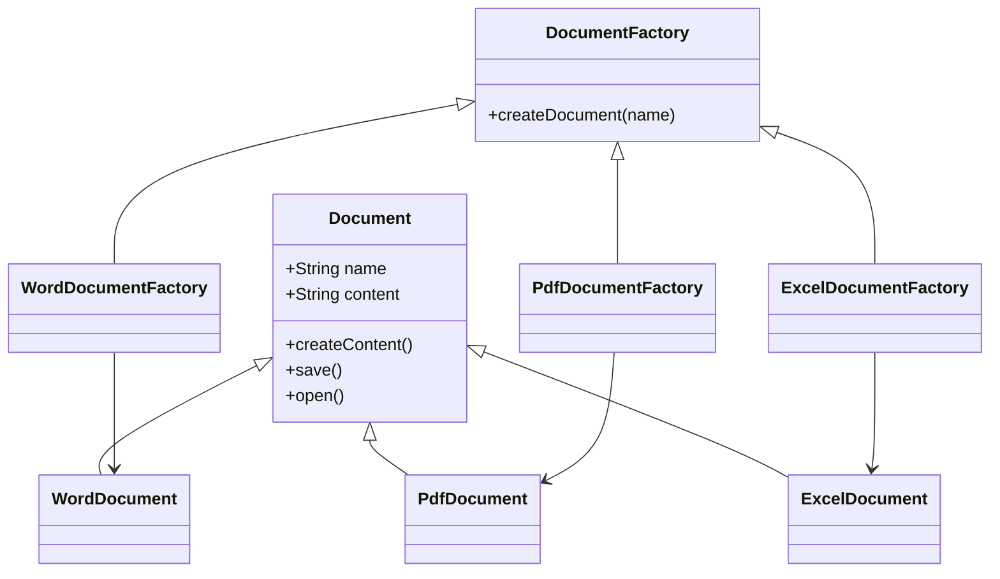

# Factory Method Pattern Example: Document Management System

## Overview
This project demonstrates the **Factory Method Pattern** using a document management system that can create different types of documents (Word, PDF, Excel). The pattern allows the system to instantiate document objects without specifying their exact classes, making the code flexible and extensible.

---

## Key Components

### 1. Abstract Product: `Document`
```java
public abstract class Document {
    protected String name;
    protected String content;
    public Document(String name) { ... }
    public abstract void createContent();
    public abstract void save();
    public abstract void open();
    // ... getters, setters, displayInfo()
}
```
Defines the interface for all document types. All documents must implement methods for creating content, saving, and opening.

---

### 2. Concrete Products: `WordDocument`, `PdfDocument`, `ExcelDocument`
Each class extends `Document` and implements its methods in a way specific to its type.

**Example: WordDocument**
```java
public class WordDocument extends Document {
    public WordDocument(String name) { super(name); }
    @Override
    public void createContent() { ... }
    @Override
    public void save() { ... }
    @Override
    public void open() { ... }
    public void addFormatting(String text, String format) { ... }
}
```
- `PdfDocument` and `ExcelDocument` have similar structures, with their own specific methods (e.g., `addSecurity`, `addFormula`).

---

### 3. Creator (Abstract Factory): `DocumentFactory`
```java
public abstract class DocumentFactory {
    public abstract Document createDocument(String name);
}
```
Declares the factory method for creating documents.

---

### 4. Concrete Factories: `WordDocumentFactory`, `PdfDocumentFactory`, `ExcelDocumentFactory`
Each factory implements the `createDocument` method to instantiate its specific document type.

**Example: WordDocumentFactory**
```java
public class WordDocumentFactory extends DocumentFactory {
    @Override
    public Document createDocument(String name) {
        return new WordDocument(name);
    }
}
```

---

### 5. Client: `DocumentManagementTest`
This class demonstrates how to use the factories to create and work with different document types.

```java
public class DocumentManagementTest {
    public static void main(String[] args) {
        DocumentFactory wordFactory = new WordDocumentFactory();
        Document wordDoc = wordFactory.createDocument("Sample Report");
        wordDoc.createContent();
        wordDoc.save();
        wordDoc.open();
        ((WordDocument) wordDoc).addFormatting("Important text", "Bold");
        // ... similar for PDF and Excel
    }
}
```

---

## How the Pattern Works
1. **Client chooses a factory** (e.g., `WordDocumentFactory`).
2. **Client calls `createDocument`** to get a new document object.
3. **Client interacts with the document** through the `Document` interface, not knowing its concrete type.
4. **Each document type can have its own special methods** (e.g., formatting, security, formulas).

---

## Why Use the Factory Method Pattern?
- **Extensibility:** Add new document types by creating new classes and factories, without changing existing code.
- **Decoupling:** Client code is independent of concrete document classes.
- **Single Responsibility:** Each factory is responsible for creating a specific type of document.

---

## Class Diagram


---

## Example Output
```
=== Factory Method Pattern Demo ===

1. Creating and working with Word Document:
Creating Word document content...
Document: Sample Report
Type: WordDocument
Content: This is a Word document with rich text formatting.
It supports bold, italic, underline, and other text styles.
Document created: 2025-06-23T20:07:51.895480600
---
Saving Word document 'Sample Report' as .docx file
Applying Word-specific formatting and compression...
Opening Word document 'Sample Report' with Microsoft Word or compatible application
Loading rich text formatting and styles...
Applying Bold formatting to: Important text

2. Creating and working with PDF Document:
Creating PDF document content...
Document: User Manual
Type: PdfDocument
Content: This is a PDF document with fixed layout formatting.
It maintains consistent formatting across different devices.
Document created: 2025-06-23T20:07:51.912648700
---
Saving PDF document 'User Manual' as .pdf file
Applying PDF-specific compression and security...
Opening PDF document 'User Manual' with PDF reader application
Loading fixed layout and rendering pages...
Adding password protection to PDF: secret123

3. Creating and working with Excel Document:
Creating Excel document content...
Document: Financial Data
Type: ExcelDocument
Content: This is an Excel document with spreadsheet data.
It supports formulas, charts, and tables.
Document created: 2025-06-23T20:07:51.919539500
---
Saving Excel document 'Financial Data' as .xlsx file
Applying Excel-specific data validation and compression...
Opening Excel document 'Financial Data' with Microsoft Excel or compatible application
Loading spreadsheet data and formulas...
Adding formula to Excel: =SUM(A1:A10)

=== Factory Method Pattern Demo Complete ===

---

## Summary
The Factory Method Pattern lets you create different types of documents in a flexible, extensible way, without the client code needing to know the details of each document type. This makes your codebase easier to maintain and extend as new requirements arise. 
