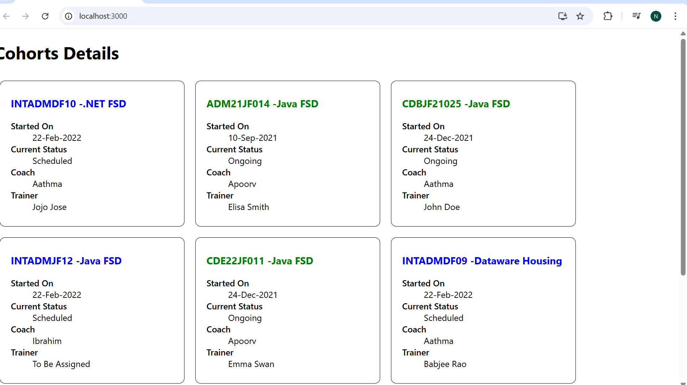

# Getting Started with Create React App

This project was bootstrapped with [Create React App](https://github.com/facebook/create-react-app).

## Available Scripts

In the project directory, you can run:

### `npm start`

Runs the app in the development mode.\
Open [http://localhost:3000](http://localhost:3000) to view it in your browser.

The page will reload when you make changes.\
You may also see any lint errors in the console.

### `npm test`

Launches the test runner in the interactive watch mode.\
See the section about [running tests](https://facebook.github.io/create-react-app/docs/running-tests) for more information.

### `npm run build`

Builds the app for production to the `build` folder.\
It correctly bundles React in production mode and optimizes the build for the best performance.

The build is minified and the filenames include the hashes.\
Your app is ready to be deployed!

See the section about [deployment](https://facebook.github.io/create-react-app/docs/deployment) for more information.

### `npm run eject`

**Note: this is a one-way operation. Once you `eject`, you can't go back!**

If you aren't satisfied with the build tool and configuration choices, you can `eject` at any time. This command will remove the single build dependency from your project.

Instead, it will copy all the configuration files and the transitive dependencies (webpack, Babel, ESLint, etc) right into your project so you have full control over them. All of the commands except `eject` will still work, but they will point to the copied scripts so you can tweak them. At this point you're on your own.

You don't have to ever use `eject`. The curated feature set is suitable for small and middle deployments, and you shouldn't feel obligated to use this feature. However we understand that this tool wouldn't be useful if you couldn't customize it when you are ready for it.

## Learn More

You can learn more in the [Create React App documentation](https://facebook.github.io/create-react-app/docs/getting-started).

To learn React, check out the [React documentation](https://reactjs.org/).

### Code Splitting

This section has moved here: [https://facebook.github.io/create-react-app/docs/code-splitting](https://facebook.github.io/create-react-app/docs/code-splitting)

### Analyzing the Bundle Size

This section has moved here: [https://facebook.github.io/create-react-app/docs/analyzing-the-bundle-size](https://facebook.github.io/create-react-app/docs/analyzing-the-bundle-size)

### Making a Progressive Web App

This section has moved here: [https://facebook.github.io/create-react-app/docs/making-a-progressive-web-app](https://facebook.github.io/create-react-app/docs/making-a-progressive-web-app)

### Advanced Configuration

This section has moved here: [https://facebook.github.io/create-react-app/docs/advanced-configuration](https://facebook.github.io/create-react-app/docs/advanced-configuration)

### Deployment

This section has moved here: [https://facebook.github.io/create-react-app/docs/deployment](https://facebook.github.io/create-react-app/docs/deployment)

### `npm run build` fails to minify

This section has moved here: [https://facebook.github.io/create-react-app/docs/troubleshooting#npm-run-build-fails-to-minify](https://facebook.github.io/create-react-app/docs/troubleshooting#npm-run-build-fails-to-minify)

# React Applications Collection

This repository contains a collection of React applications developed as part of a learning journey. Each application demonstrates different React concepts and features.

## 📁 Project Structure

```
Week 6/
├── blogapp/           # Blog application with posts
├── cohorttracker/     # Cohort management system
├── myfirstreactapp/   # Basic React starter app
├── scorecalculator/   # Score calculation application
└── studentapp/        # Student information application
```

## 🚀 Applications

### 1. Blog App (`blogapp/`)
A simple blog application that displays posts with titles and content.

**Features:**
- Post listing
- Individual post components
- Responsive design

**To run:**
```bash
cd blogapp
npm install
npm start
```

### 2. Cohort Tracker (`cohorttracker/`)
A comprehensive cohort management system for tracking training programs.

**Features:**
- Cohort listing and details
- Status-based color coding (Green for ongoing, Blue for scheduled)
- CSS Modules for styling
- Responsive design with box layouts

**Key Components:**
- `CohortDetails.js` - Individual cohort display with conditional styling
- `CohortDetails.module.css` - CSS Module with box styling and typography

**To run:**
```bash
cd cohorttracker
npm install
npm start
```

### 3. My First React App (`myfirstreactapp/`)
A basic React starter application demonstrating fundamental React concepts.

**Features:**
- Basic component structure
- React fundamentals

**To run:**
```bash
cd myfirstreactapp
npm install
npm start
```

### 4. Score Calculator (`scorecalculator/`)
An application for calculating and managing scores.

**Features:**
- Score calculation functionality
- Component-based architecture
- Custom styling

**Components:**
- `CalculateScore.js` - Main calculation component
- Custom CSS styling in `Components/Stylesheets/`

**To run:**
```bash
cd scorecalculator
npm install
npm start
```

### 5. Student App (`studentapp/`)
A student information management application with multiple pages.

**Features:**
- Multi-page navigation
- About, Contact, and Home pages
- Component-based routing

**Components:**
- `Home.js` - Home page component
- `About.js` - About page component
- `Contact.js` - Contact page component

**To run:**
```bash
cd studentapp
npm install
npm start
```

## 🛠️ Technologies Used

- **React.js** - Frontend framework
- **CSS Modules** - Component-scoped styling
- **JavaScript (ES6+)** - Programming language
- **HTML5** - Markup language

## 📋 Prerequisites

Before running any of these applications, make sure you have:

- **Node.js** (version 14 or higher)
- **npm** (comes with Node.js)

## 🔧 Installation & Setup

1. **Clone or download this repository**
2. **Navigate to any specific application directory**
3. **Install dependencies:**
   ```bash
   npm install
   ```
4. **Start the development server:**
   ```bash
   npm start
   ```
5. **Open your browser and visit:** `http://localhost:3000`

## 🎨 CSS Modules Implementation

The `cohorttracker` application demonstrates the use of CSS Modules:

- **File:** `CohortDetails.module.css`
- **Features:**
  - `.box` class with 300px width, inline-block display
  - 10px overall margin, 10px top/bottom padding, 20px left/right padding
  - 1px black border with 10px border-radius
  - `dt` element styling with font-weight: 500
  - Conditional h3 color styling (green for ongoing, blue for others)


### Cohort Tracker Output



