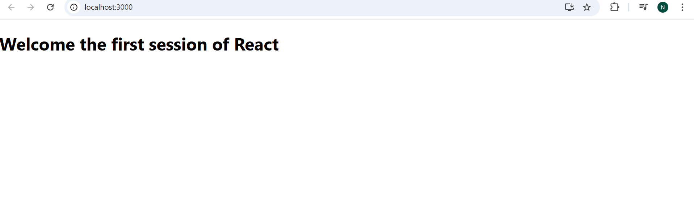

# My First React App

This is a simple React application created using Create React App.

## Output

Below is a screenshot of the application output:

The app displays a welcome message: **Welcome the first session of React**

## Explanation

This React app demonstrates a basic functional component called `App`. When the app is run, it renders a single heading (`<h1>`) element to the browser window. The heading displays the message "Welcome the first session of React". This is a typical starting point for learning React, showing how to create and render a component, and how JSX is used to define the UI. 