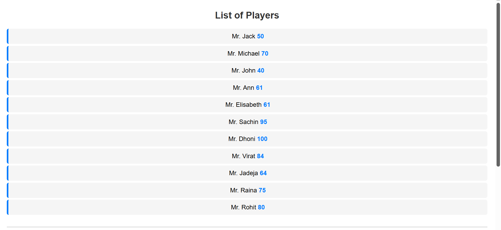
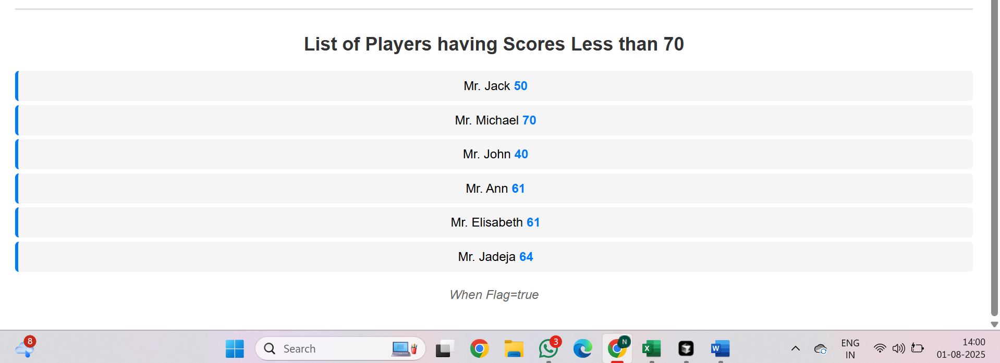

# Cricket App - React Lab

This is a React application that demonstrates various ES6 features including:
- Array mapping
- Arrow functions
- Destructuring
- Spread operator
- Conditional rendering

## Features

1. **List of Players**: Displays 11 cricket players with their names and scores
2. **Score Filtering**: Shows players with scores below 70
3. **Indian Team**: Displays odd and even players using destructuring
4. **Merged Players**: Shows merged T20 and Ranji Trophy players using spread operator

## How to Run

1. Navigate to the cricketapp directory:
   ```bash
   cd cricketapp
   ```

2. Install dependencies:
   ```bash
   npm install
   ```

3. Start the development server:
   ```bash
   npm start
   ```

4. Open [http://localhost:3000](http://localhost:3000) to view it in the browser.

## How to Switch Views

To switch between the two views, edit the `flag` variable in `src/App.js`:

- Set `var flag = true;` to see the list of players and filtered scores
- Set `var flag = false;` to see the Indian team with odd/even players and merged list

## Components

- `ListofPlayers`: Displays all players using ES6 map
- `Scorebelow70`: Filters players with scores ≤ 70 using arrow functions
- `OddPlayers`: Shows odd team players using destructuring
- `EvenPlayers`: Shows even team players using destructuring
- `ListofIndianPlayers`: Displays merged Indian players list
- `IndianPlayers`: Data file with merged arrays using spread operator

## ES6 Features Demonstrated

1. **Arrow Functions**: Used in map operations and component definitions
2. **Destructuring**: Used in OddPlayers and EvenPlayers components
3. **Spread Operator**: Used to merge T20Players and RanjiTrophyPlayers arrays
4. **Map Method**: Used to iterate over arrays and render components
5. **Template Literals**: Used in component rendering

## Expected Outputs

### Output 1 (When Flag = true)


- **List of Players**: Shows all 11 players with their names and scores
  - Mr. Jack 50
  - Mr. Michael 70
  - Mr. John 40
  - Mr. Ann 61
  - Mr. Elisabeth 61
  - Mr. Sachin 95
  - Mr. Dhoni 100
  - Mr. Virat 84
  - Mr. Jadeja 64
  - Mr. Raina 75
  - Mr. Rohit 80

- **List of Players having Scores Less than 70**: Shows filtered players
  - Mr. Jack 50
  - Mr. Michael 70
  - Mr. John 40
  - Mr. Ann 61
  - Mr. Elisabeth 61
  - Mr. Jadeja 64
  

### Output 2 (When Flag = false)


- **Indian Team**
  - **Odd Players**:
    - First: Sachin1
    - Third: Virat3
    - Fifth: Yuvaraj5
  - **Even Players**:
    - Second: Dhoni2
    - Fourth: Rohit4
    - Sixth: Raina6
- **List of Indian Players Merged**:
  - Mr. First Player
  - Mr. Second Player
  - Mr. Third Player
  - Mr. Fourth Player
  - Mr. Fifth Player
  - Mr. Sixth Player
