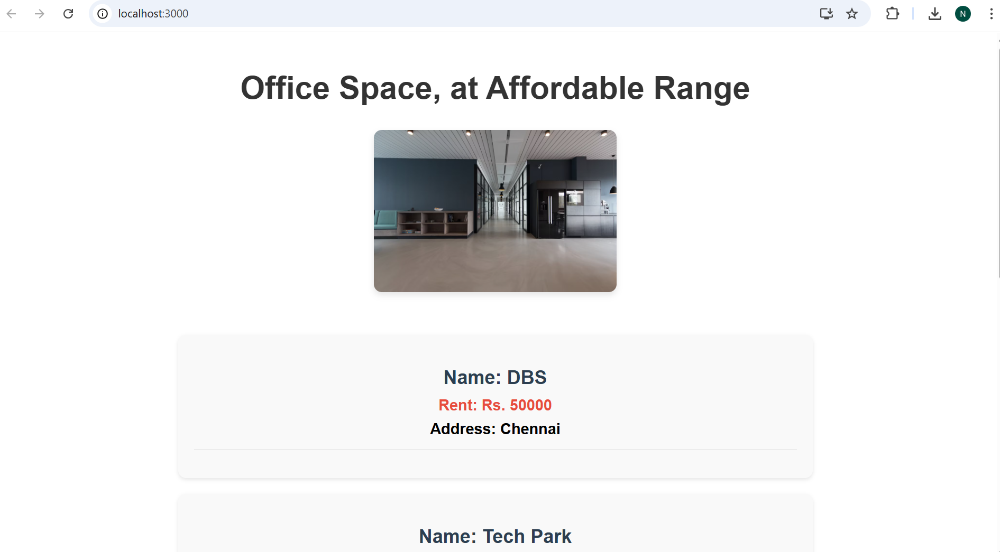
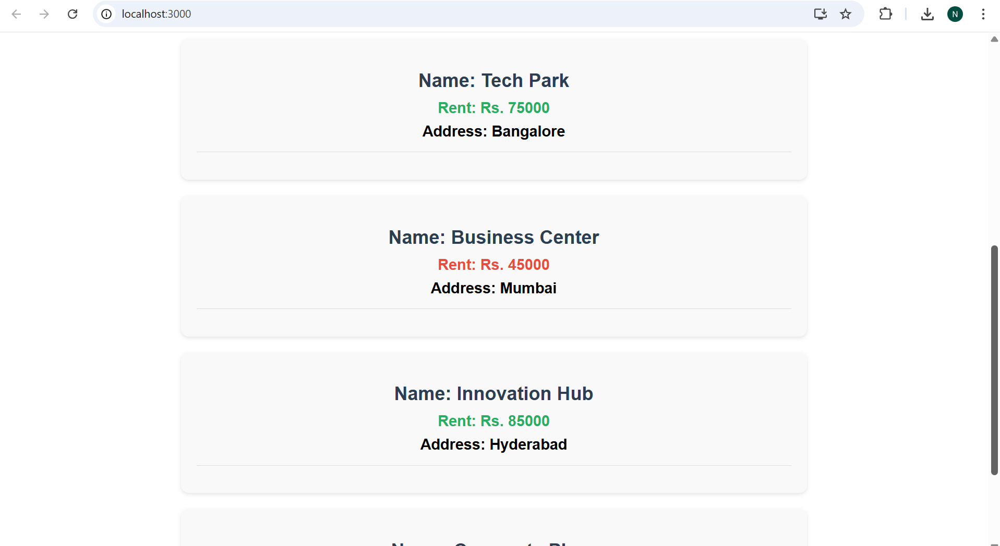

# Office Space Rental Application

A React application that displays office space listings with conditional styling based on rent prices.

## Features

- **Dynamic Office Listings**: Displays multiple office spaces with details
- **Conditional Styling**: Rent amounts are colored red (≤60000) or green (>60000)
- **Responsive Design**: Modern UI with hover effects and card-based layout
- **JSX Implementation**: Uses React JSX for elements, attributes, and DOM rendering

## Implementation Details

### Components
- **Heading Element**: "Office Space, at Affordable Range"
- **Image Attribute**: Office space image with responsive sizing
- **Office Objects**: Contains Name, Rent, and Address properties
- **Data Looping**: Maps through office array to display all listings

### Conditional Styling
- **Red Color**: Rent ≤ Rs. 60,000 (affordable range)
- **Green Color**: Rent > Rs. 60,000 (premium range)

### Sample Data
The application includes 5 office spaces:
- DBS (Chennai) - Rs. 50,000
- Tech Park (Bangalore) - Rs. 75,000
- Business Center (Mumbai) - Rs. 45,000
- Innovation Hub (Hyderabad) - Rs. 85,000
- Corporate Plaza (Delhi) - Rs. 55,000

## Screenshots

### Output 1

*Main view showing the office space application with heading, image, and first office listing*

### Output 2

*Detailed view showing multiple office listings with conditional rent color styling*

## Getting Started

### Prerequisites
- Node.js (version 14 or higher)
- npm package manager

### Installation

1. Clone or download the project
2. Navigate to the project directory:
   ```bash
   cd officespacerentalapp
   ```

3. Install dependencies:
   ```bash
   npm install
   ```

4. Start the development server:
   ```bash
   npm start
   ```

5. Open [http://localhost:3000](http://localhost:3000) to view the application

## Available Scripts

- `npm start` - Runs the app in development mode
- `npm test` - Launches the test runner
- `npm run build` - Builds the app for production
- `npm run eject` - Ejects from Create React App (one-way operation)

## Technologies Used

- React.js
- JSX
- CSS3
- Create React App

## Project Structure

```
officespacerentalapp/
├── public/
├── src/
│   ├── App.js          # Main application component
│   ├── App.css         # Application styles
│   ├── index.js        # Application entry point
│   └── index.css       # Global styles
├── output1.png         # Application screenshot 1
├── output2.png         # Application screenshot 2
└── README.md           # This file
```

## Key Features Implemented

✅ React JSX elements and attributes  
✅ DOM rendering with dynamic content  
✅ Object creation with office details  
✅ Array looping through office listings  
✅ Conditional CSS styling for rent colors  
✅ Responsive and modern UI design  

## Browser Compatibility

The application is compatible with all modern browsers and is optimized for desktop and mobile viewing.
